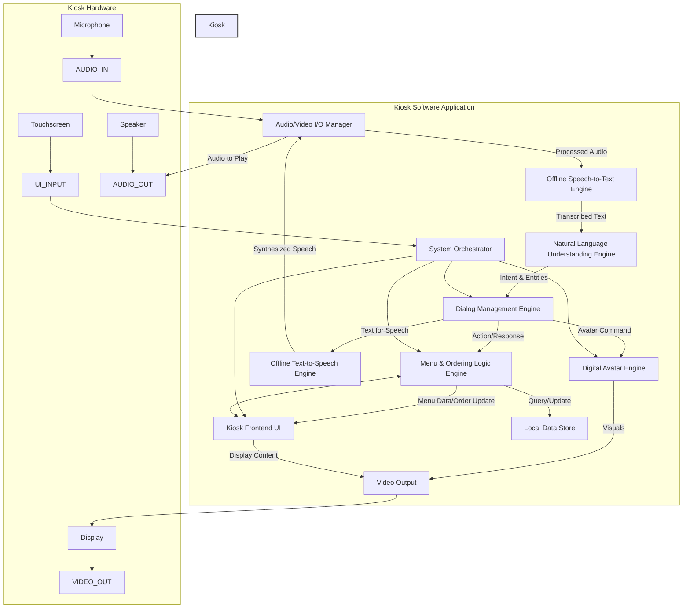

# AI-Powered Kiosk System: Architectural Plan

**Project Goal**: Create a kiosk with AI menu navigation featuring a digital avatar helper that can talk to users naturally in an offline environment.

## 1. System Architecture Diagram and Component Breakdown



**Component Breakdown:**

*   **A. Kiosk Frontend UI (User Interface):**
    *   **Responsibilities:** Displaying menu, avatar, order; handling touch/click navigation; visual feedback; dual-mode interaction (voice + touch).
    *   **Key Features:**
        - Touch-optimized interface with full menu navigation
        - Intuitive button layout and clear visual hierarchy
        - Complete ordering workflow without voice interaction
        - Accessibility features for different user preferences
        - Seamless switching between voice and touch modes
        - Visual indicators for interactive elements

*   **B. Digital Avatar Engine:**
    *   **Responsibilities:** Rendering 2D avatar, animating expressions, basic lip-sync.
    *   **Key Features:** Lightweight, smooth animations, API for control.

*   **C. Offline Speech-to-Text (STT) Engine:**
    *   **Responsibilities:** Audio capture, speech-to-text conversion (offline).
    *   **Key Features:** High accuracy, low latency, noise robustness.

*   **D. Offline Text-to-Speech (TTS) Engine:**
    *   **Responsibilities:** Text-to-speech conversion (offline), avatar voice.
    *   **Key Features:** Natural voice, customizable, low latency.

*   **E. Natural Language Understanding (NLU) Engine:**
    *   **Responsibilities:** Advanced natural language understanding using Gemma 3:4B, context-aware conversation management, sophisticated intent recognition and entity extraction, prompt engineering for menu-specific tasks.
    *   **Key Features:**
        - Local Gemma 3:4B model inference for complete offline operation
        - OpenAI-compatible API integration for seamless communication
        - Context preservation across conversation turns
        - Advanced intent recognition and entity extraction
        - Prompt template management for menu-specific scenarios
        - Fallback mechanisms for model unavailability
        - Performance optimization for local inference

*   **F. Dialog Management Engine:**
    *   **Responsibilities:** Conversation flow, context management, response generation, avatar commands.
    *   **Key Features:** State management, decision making, context handling.

*   **G. Menu & Ordering Logic Engine:**
    *   **Responsibilities:** Menu data management, order processing, inventory (simple), dual-input handling (voice + touch).
    *   **Key Features:**
        - Business logic for menu/orders with unified API
        - Support for both voice commands and touch interactions
        - Menu browsing, filtering, and search capabilities
        - Item customization through touch interface
        - Cart management with visual feedback
        - Order validation and confirmation workflows

*   **H. Local Data Store:**
    *   **Responsibilities:** Storing menu data, configurations, active orders.
    *   **Key Features:** Lightweight, fast, offline (SQLite, JSON).

*   **I. Audio/Video I/O Manager:**
    *   **Responsibilities:** Mic/speaker access, audio preprocessing, TTS routing, display coordination.
    *   **Key Features:** Hardware abstraction, stream management.

*   **J. System Orchestrator:**
    *   **Responsibilities:** Module lifecycle, inter-module communication, system events/errors.
    *   **Key Features:** Central coordination, data flow.

## 2. Technology Stack Recommendations (Offline Focus)

*   **Frontend Kiosk UI:** Electron.js (HTML, CSS, JS/TS) or Qt (C++) / .NET MAUI/WPF (C#).
*   **Digital Avatar Engine:** SVG animations, Lottie, GreenSock (GSAP) for 2D.
*   **Offline STT:** Vosk API, Mozilla DeepSpeech, or CMU Sphinx.
*   **Offline TTS:** Mozilla TTS, eSpeak NG, Festival, or Pico TTS.

### AI/NLU

*   **Local LLM:** Gemma 3:4B model running locally via Ollama or similar local inference server
*   **API Integration:** OpenAI-compatible API client for seamless integration with local model
*   **NLU Engine:** Advanced natural language understanding powered by Gemma 3:4B
*   **Prompt Management:** Template-based prompt engineering for menu-specific tasks
*   **Context Management:** Conversation state preservation across multiple turns
*   **Fallback System:** Graceful degradation to pattern matching when model unavailable

*   **Dialog Management:** Custom State Machine with LLM integration (Python, JS, C#).
*   **Menu & Ordering Logic / System Orchestrator:** Python, Node.js, or C#.
*   **Local Data Store:** SQLite, JSON files.
*   **Operating System:** Linux (Ubuntu Core, Yocto) or Windows 10/11 IoT Enterprise.

## 3. File Structure and Project Organization

```
/ai-kiosk-system/
|
├── /app/                     # Main application source code
│   ├── /ui/                  # Frontend UI components
│   │   ├── /components/      # Reusable UI components
│   │   ├── /pages/           # Menu pages and navigation
│   │   ├── /touch_interface/ # Touch-optimized controls
│   │   └── /accessibility/   # Accessibility features
│   ├── /avatar/              # Avatar rendering
│   ├── /speech_input/        # STT integration
│   ├── /speech_output/       # TTS integration
│   ├── /nlu/                 # Enhanced NLU with Gemma 3:4B integration
│   │   ├── /llm_client/      # OpenAI-compatible API client
│   │   ├── /prompt_templates/# Prompt engineering templates
│   │   ├── /context_manager/ # Conversation context management
│   │   └── /fallback/        # Fallback NLU mechanisms
│   ├── /dialog_manager/      # Dialog management with LLM integration
│   ├── /menu_engine/         # Menu & ordering logic with dual-input support
│   │   ├── /touch_handlers/  # Touch interaction handlers
│   │   ├── /voice_handlers/  # Voice command handlers
│   │   └── /unified_api/     # Unified interface for both input methods
│   ├── /orchestrator/        # System orchestrator
│   └── /common/              # Shared utilities
|
├── /data/                    # Data files
│   ├── /menu/                # Menu data (menu.json/sqlite)
│   ├── /stt_models/          # STT models
│   ├── /tts_models/          # TTS models
│   ├── /llm_models/          # Gemma 3:4B model files
│   ├── /prompt_configs/      # Prompt template configurations
│   └── /avatar_assets/       # Avatar assets
|
├── /config/                  # Configuration files
│   ├── llm_config.json       # LLM API and model configuration
│   ├── prompt_config.json    # Prompt template settings
│   └── nlu_config.json       # NLU engine configuration
|
├── /scripts/                 # Build, deployment scripts
│   └── setup_llm.sh/bat      # LLM server setup script
|
├── /docs/                    # Documentation
│   └── llm_setup.md          # LLM deployment guide
|
├── /tests/                   # Tests
│   ├── /unit/
│   ├── /integration/
│   └── /llm_tests/           # LLM-specific tests
|
└── main.js/py/cs             # Main entry point
```

## 4. Dual-Mode Interaction Design

The kiosk system supports two primary interaction modes to accommodate different user preferences and accessibility needs:

### Touch/Click Navigation Mode
*   **Complete Independence:** Users can complete entire ordering process without voice interaction
*   **Intuitive Interface:** Large, clearly labeled buttons and visual menu hierarchy
*   **Menu Browsing:** Category-based navigation with filtering and search capabilities
*   **Item Customization:** Touch-friendly controls for size, options, and modifications
*   **Cart Management:** Visual cart with add/remove/modify capabilities
*   **Checkout Process:** Step-by-step guided checkout with confirmation screens

### Voice Interaction Mode
*   **Natural Language:** Powered by Gemma 3:4B for sophisticated understanding
*   **Context Awareness:** Maintains conversation context across multiple turns
*   **Hands-Free Operation:** Complete ordering without touching the screen
*   **Avatar Assistance:** Visual avatar provides feedback and guidance

### Hybrid Mode
*   **Seamless Switching:** Users can switch between voice and touch at any point
*   **Unified State:** Cart and order state synchronized across both modes
*   **Complementary Features:** Touch for precise selection, voice for quick commands
*   **Accessibility:** Accommodates users with different abilities and preferences

## 5. Integration Strategy Between Components

*   **Communication:** Internal Event Bus / Message Queue (managed by System Orchestrator) for loose coupling; Direct Method Calls/APIs for tight coupling.
*   **Data Format:** Standardized JSON or language-specific objects.

### LLM Integration Strategy

*   **API Communication:** OpenAI-compatible API client communicates with local Gemma 3:4B server
*   **Prompt Template Management:** Centralized prompt templates for different conversation scenarios
*   **Context Preservation:** Conversation history maintained across turns for coherent interactions
*   **Error Handling:** Graceful fallback to pattern matching when local model is unavailable
*   **Performance Optimization:** Request batching and caching for improved response times

### Configuration Management

*   **OpenAI-Compatible API Configuration:**
    - Base URL pointing to local Gemma 3:4B server (e.g., http://localhost:11434/v1)
    - Model parameters (temperature, max_tokens, top_p)
    - Timeout and retry settings
*   **Prompt Template Configuration:**
    - Menu-specific prompt templates
    - Context injection strategies
    - Response formatting rules
*   **Model Performance Tuning:**
    - Inference parameters optimization
    - Memory management settings
    - Concurrent request handling

*   **Key Flows:**

### Voice Interaction Flow:
    1.  Voice Input: Mic -> AV I/O -> STT -> NLU (Gemma 3:4B).
    2.  NLU Processing: User input + context -> Prompt Template -> LLM API -> Structured Response.
    3.  Dialog Decision: NLU Response -> Dialog Manager -> Menu Engine / TTS / Avatar Engine.
    4.  Context Update: Dialog Manager -> Context Manager (preserve conversation state).
    5.  Updates: Menu Engine -> UI / Data Store.
    6.  Avatar Response: TTS -> AV I/O -> Speaker; Avatar Engine -> Display.

### Touch/Click Interaction Flow:
    1.  Touch Input: Touchscreen -> UI Touch Handlers -> Menu Engine Unified API.
    2.  Menu Navigation: UI -> Menu Engine -> Data Store (fetch menu data).
    3.  Item Selection: Touch -> Menu Engine -> Cart Management -> UI Update.
    4.  Customization: Touch Interface -> Menu Engine -> Item Configuration -> UI Feedback.
    5.  Order Management: Cart Actions -> Menu Engine -> Data Store -> UI Refresh.
    6.  Checkout Process: Touch Workflow -> Menu Engine -> Order Validation -> Confirmation UI.

### Hybrid Interaction Flow:
    7.  Mode Switching: User can seamlessly switch between voice and touch at any point.
    8.  Unified State: Both input methods share the same cart and order state.
    9.  Avatar Assistance: Avatar provides visual feedback for both voice and touch interactions.

### Fallback Flow:
    10. LLM Unavailable -> Pattern Matching NLU -> Dialog Manager (voice mode only).
    11. Touch mode remains fully functional regardless of voice system status.

## 5. Development Roadmap with Prioritized Phases

**Phase 1: Core Offline Viability & Dual-Mode Interaction Setup**
*   **Goal:** Foundational offline capabilities with both advanced LLM-powered NLU and comprehensive touch navigation.
*   **Tasks:**
    - OS/Hardware setup
    - Local Gemma 3:4B deployment (Ollama setup)
    - OpenAI-compatible API client implementation
    - Basic prompt template system
    - Context management foundation
    - Touch-optimized UI with full menu navigation
    - Complete touch-based ordering workflow
    - STT, TTS integration for voice mode
    - Enhanced NLU with sophisticated intent recognition
    - Dual-mode Dialog Manager (voice + touch)
    - Interactive Menu Display with touch controls
    - Unified Menu Engine API for both input methods
    - Fallback mechanism implementation
    - Mode switching capabilities
*   **Deliverable:** Kiosk supports both natural language voice commands and complete touch navigation, allowing users to order entirely through touch interface or voice interaction, operates completely offline.

**Phase 2: Advanced Menu Navigation & Ordering Logic**
*   **Goal:** Full menu browsing and core ordering with enhanced user experience.
*   **Tasks:**
    - Advanced Menu & Ordering Engine with filtering and search
    - Enhanced Local Data Store with menu categories and item details
    - Rich UI components (Menu/Cart/Customization screens)
    - Touch-based item customization interface
    - Advanced cart management with visual feedback
    - Expand NLU & Dialog for complex ordering scenarios
    - Menu recommendations and upselling logic
    - Order history and favorites (optional)
*   **Deliverable:** Users can navigate, filter, search, customize, and build complex orders seamlessly via either voice commands or touch interface, with rich visual feedback and intuitive workflows.

**Phase 3: Digital Avatar Integration**
*   **Goal:** Introduce avatar and basic emotional responses.
*   **Tasks:** Avatar Engine (2D), Basic Animations, Integrate with Dialog Manager, Basic TTS Sync, UI for Avatar.
*   **Deliverable:** Kiosk features a reacting digital avatar.

**Phase 4: Refinement, Robustness & User Experience**
*   **Goal:** Improve naturalness, handle edge cases, enhance UX.
*   **Tasks:** Advanced NLU/Dialog, Improve TTS/Avatar, Usability Testing, Performance Optimization, Error Logging.
*   **Deliverable:** Polished, robust, natural-feeling kiosk.

**Phase 5: Deployment & Finalization (Consideration)**
*   **Goal:** Prepare for deployment.
*   **Tasks:** Kiosk Mode, Update Strategy (offline), Final Hardware Tests.